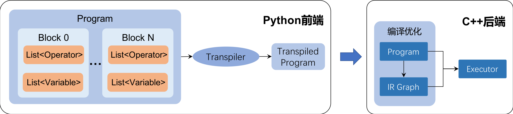
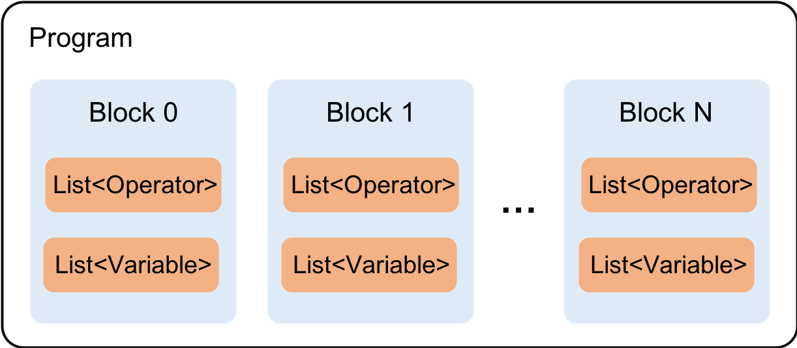
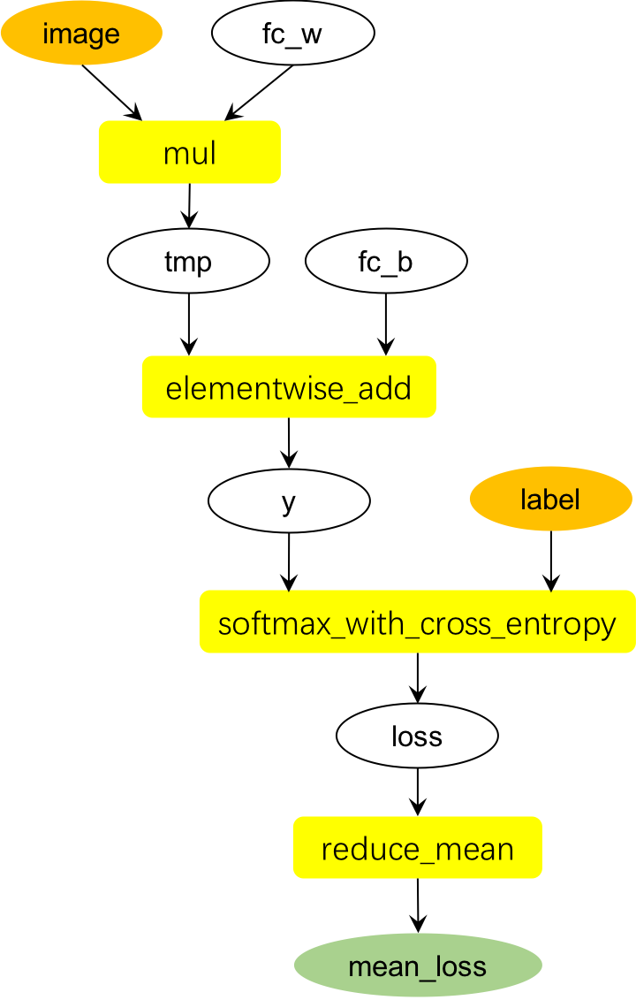

## 一、概述

本文档介绍飞桨（PaddlePaddle）底层的设计思想，适于有一定深度学习背景的用户阅读。此文档有助于：

- 帮助用户更好的理解框架运作过程，便于程序编写与调试；
- 便于用户基于飞桨框架进行二次开发，满足个性化需求。

飞桨将神经网络抽象为计算表示**Operator**和数据表示**Variable**。
神经网络的每层操作均由一个或若干**Operator**组成，每个**Operator**接受一系列的**Variable**作为输入，经计算后输出一系列的**Variable**。

<p align="center">
	 
</p>

根据**Operator**解析执行方式的不同，飞桨支持以下两种编程范式：

- 静态图模式（声明式编程范式）：先编译后执行的方式。用户需先定义完整的网络结构，然后对网络结构进行编译优化，才能执行获得计算结果。
- 动态图模式（命令式编程范式）：解析式的执行方式。用户无需预先定义完整的网络结构，每写一行网络代码均可即刻获得计算结果。

以下通过一个例子直观地展示静态图模式和动态图模式的异同。
假设网络中有**y = x + 1**的代码，在静态图模式下，运行此代码只会往计算图中插入一个Tensor加1的**Operator**，此时**Operator**并未真正地执行，无法获得y的计算结果。
但在动态图模式下，所有**Operator**均是即时执行的，因此运行完此代码后**Operator**已经执行完毕，用户可直接输出y的计算结果。

两种编程范式的优劣如下表所示。

| 对比项 | 静态图模式 | 动态图模式 |
|---|---|---|
| 是否可即时获得每层计算结果 | 不能，必须构建完整网络后才能运行 | 能 |
| 调试难易性 | 欠佳，不易调试 | 结果即时，调试方便 |
| 性能 | 由于计算图完全确定，可优化的空间更多，往往性能更佳 | 计算图动态生成，图优化的灵活性受限，一般性能不如静态图 |
| 预测部署能力 | 可直接进行预测部署 | 不可直接预测部署，往往需转换为静态图模型后才能部署 |

## 二、静态图设计思想

在静态图模式下，飞桨将神经网络描述为**Program**的数据结构，使用一种编程器式的执行流程，分为编译期和运行期两个阶段：

- 编译期：用户调用飞桨提供的API编写一段Python程序，向**Program**中添加变量**Variable**和算子**Operator**。用户只需要描述核心的前向计算，不需要关心反向计算、分布式下以及异构设备下如何计算。
- 执行期：对**Program**进行编译优化，然后使用执行器**Executor**，创建**Program**中定义的变量，并执行**Program**中定义的算子。 

飞桨静态图核心架构如下图所示。在Python前端，**Program**由一系列的**Block**组成，每个**Block**持有自己的**Operator**和**Variable**。
随后，**Transpiler**将用户定义的**Program**转换为一个优化后的**Program**（如分布式训练时将原来的**Program**拆分为Parameter Server端
和Trainer端的**Program**等），**Transpiler**转换不是必需的。Python端的**Program**在C++后端转换为统一的中间表达（**Intermediate Representation**），
并进行相应的优化，包括Operator Fusion、存储优化等，最终得到优化后的、可执行的计算图。**Executor**负责执行优化后的计算图，创建计算图中的
**Variable**，调度图中的**Operator**，完成模型训练/预测过程。

<p align="center">
	 
</p>

以下介绍飞桨静态图的核心概念，包括：

- **Variable** 
- **Operator** 
- **Block**
- **Program**
- **Transpiler**
- **Intermediate Representation**
- **Executor**

### 2.1. Variable

飞桨的**Variable**表示网络中的数据。 **Variable**的C++底层数据结构为Protobuf表示的**VarDesc**，只包含数据的静态描述，不包含任何运行时的状态信息。
**VarDesc**包含以下字段信息：

```
message VarDesc {
  // Variable的名称
  required string name = 1;
  
  // Variable的类型，例如LOD_TENSOR、LOD_TENSOR_ARRAY等
  required VarType type = 2;
  
  // 是否为持久性变量，持久性变量在模型运行过程中不会销毁，持久性变量包括：模型参数、优化器参数等
  // 非持久性变量可能在模型运行过程中销毁
  optional bool persistable = 3;
}
```

### 2.2. Operator

飞桨的**Operator**表示网络中的算子。 **Operator**的C++底层数据结构为Protobuf表示的**OpDesc**，只包含算子的静态描述，不包含任何运行时的状态信息。
**OpDesc**包含以下字段信息：

```
message OpDesc {
  // Operator的类型
  required string type = 3;
  
  // Operator的输入变量列表
  repeated Var inputs = 1;
  
  // Operator的输出变量列表
  repeated Var outputs = 2;
  
  // Operator的属性列表
  repeated Attr attrs = 4;
}
```

**Operator**各字段的定义如下：

- **type**: 表示**Operator**的类型，类型为**std::string**，取值如"relu"、"conv2d"、"elementwise_add"等。
- **inputs**: 表示**Operator**的输入，类型为**std::map<std::string, std::vector\<std::string\>>**，记录输入slot名称至实际输入**Variable**名称的映射。
- **outputs**: 表示**Operator**的输出，类型为**std::map<std::string, std::vector\<std::string\>>**，记录输出slot名称至实际输出**Variable**名称的映射。
- **attrs**: 表示**Operator**的属性，类型为**std::map<std::string, Attribute>**，记录属性名称至实际属性值的映射。飞桨支持的属性类型包括：
**bool**，**int32**，**int64**，**float32**，**std::string**，**std::vector\<bool\>**，**std::vector\<int32\>**，
**std::vector\<float32\>**，**std::vector\<std::string\>** 等。

例如，飞桨的sum算子功能为将多个shape相同的输入Tensor累加为一个输出Tensor，输入和输出的slot名称分别为"X"和"Out"。若实际输入**Variable**的名称
分别为"tmp_in_0"，"tmp_in_1"， "tmp_in_2"，实际输出**Variable**的名称为"tmp_out_0"，则此sum算子可表述为：

```python
{
    "type": "sum",
    "inputs": {"X": ["tmp_in_0", "tmp_in_1", "tmp_in_2"]},
    "outputs": {"Out": ["tmp_out_0"]},
    "attrs": {}
}
```

又如，飞桨的split算子功能为将输入Tensor延某个维度拆分为若干个Tensor，输入和输出slot的名称为"X"和"Out"。若实际输如**Variable**的名称为"tmp_in_0"，
实际输出**Variable**的名称为"tmp_out_0"， "tmp_out_1"和"tmp_out_2"，沿第1维进行拆分，则此split算子可表述为：

```python
{
    "type": "split",
    "inputs": {"X": ["tmp_in_0"]},
    "outputs": {"Out": ["tmp_out_0", "tmp_out_1", "tmp_out_2"]},
    "attrs": {"axis": 1} # "axis"是split算子的属性，表示沿哪个维度进行拆分
}
```

### 2.3. Block

飞桨的**Block**用于表示编程语言中的控制流结构，如条件结构（if-else）、循环结构（while）等。

**Block**的C++底层数据结构为Protobuf表示为**BlockDesc**，包含以下字段信息：
```
message BlockDesc {
  // 该Block的ID
  required int32 idx = 1;
  
  // 父Block的ID，类似于编程语言的父子Block关系
  required int32 parent_idx = 2;
  
  // 该Block中包含的Variable列表
  repeated VarDesc vars = 3;
  
  // 该Block中包含的Operator列表
  repeated OpDesc ops = 4;
}
```

**Block**的概念与编程语言中的类似，例如以下这段C++代码中包含三个block：

```C++
int main() { // block 0
	int i = 0;
	if (i < 10) { // block 1
		for (int j = 0; j < 10; j++){ // block 2
		}
	}
	return 0;
}
```

类似的，以下飞桨代码的**Program**包含3段block：

```Python
import paddle.fluid as fluid

limit = fluid.layers.fill_constant_batch_size_like(
    input=label, dtype='int64', shape=[1], value=5.0) # block 0
cond = fluid.layers.less_than(x=label, y=limit) # block 0

ie = fluid.layers.IfElse(cond)
with ie.true_block(): # block 1
    true_image = ie.input(image)
    hidden = fluid.layers.fc(input=true_image, size=100, act='tanh')
    prob = fluid.layers.fc(input=hidden, size=10, act='softmax')
    ie.output(prob)

with ie.false_block(): # block 2
    false_image = ie.input(image)
    hidden = fluid.layers.fc(
        input=false_image, size=200, act='tanh')
    prob = fluid.layers.fc(input=hidden, size=10, act='softmax')
    ie.output(prob)

prob = ie() # block 0
```

与编程语言类似，飞桨的每个**Block**拥有自己的**Operator**和**Variable**，表现为：
- 同一个**Block**中不允许有同名的**Variable**，否则会出现变量重定义，编译阶段会抛出错误。
- 不同**Block**允许存在同名**Variable**。
- 在查找**Variable**时，飞桨会优先在当前block中寻找，若当前block中找不到该变量，
则会递归地在父block中寻找，直到父block为空（即最顶层的block）为止。

例如以下C++代码的if分支中定义了与父block同名的变量b，因此if分支会输出当前block中的b值，而非父block中的b值。
而在else分支中，由于当前block不存在变量b，则输出父block中的b值。

```C++
#include <iostream>

void func(int a) {
    int b = 1;
    if (a == 4) { // block 1
        int b = 2;
        std::cout << b << std::endl; // 输出2
    } else { // block 2
        std::cout << b << std::endl; // 输出1
    }
    std::cout << b << std::endl; // 输出1
}
```

### 2.4. Program

**Program**的C++底层数据结构为Protobuf表示的**ProgramDesc**，由若干**BlockDesc**构成，基于Protobuf的序列化能力提供模型保存、加载功能。 

**Program**最外层的**Block**称为global block（对应Block id为0），其余**Block**称为sub block。

一段飞桨程序中通常存在2个**Program**：

- Startup Program：初始化**Operator**所在的**Program**，包括模型参数初始化、优化器参数初始化、reader初始化等**Operator**。
框架定义了一个全局默认的Startup Program，即**fluid.default_startup_program()**。若用户没有显式指定Startup Program，
则框架会使用默认的**fluid.default_startup_program()**。

- Main Program：模型主体结构所在的**Program**，包括前向计算、反向计算、模型参数更新、优化器参数更新等**Operator**。
框架定义了一个全局默认的Main Program，即**fluid.default_main_program()**。若用户没有显式指定Main Program，
则框架会使用默认的**fluid.default_main_program()**。

Startup Program用于模型初始化，Main Program负责描述网络主体结构。
因此在模型训练过程中，往往需要运行一次Startup Program，即初始化一次，然后多次运行Main Program训练模型。

以下以一段简单的飞桨代码为例，说明**Program**在编译期的变化：

```Python
import paddle.fluid as fluid

# 语句1
image = fluid.data(name='image', shape=[None, 3, 224, 224], dtype='float32')

# 语句2
conv_result = fluid.layers.conv2d(image, num_filters=64, filter_size=3)

# 语句3
loss = fluid.layers.reduce_mean(conv_result)

# 语句4
adam = fluid.optimizer.Adam(learning_rate=1e-3)

# 语句5
adam.minimize(loss)
```

以上飞桨代码各语句的内部执行机制为（由于代码中未指定Startup Program和Main Program，此处使用**fluid.default_startup_program()**和**fluid.default_main_program()**）：

- 语句1：在 **fluid.default_main_program()** 中定义变量image。
- 语句2：在**Program**中插入conv2d算子。由于conv2d算子包含参数，因此此语句还隐含地包括参数创建、参数初始化算子插入等流程，具体方式为：
    - 在 **fluid.default_startup_program()** 和 **fluid.default_main_program()** 中创建conv2d算子的权重参数weight和bias。
    - 在 **fluid.default_startup_program()** 中插入权重参数weight和bias的初始化算子。
    - 在 **fluid.default_main_program()** 中插入conv2d算子，以及conv2d的输出变量conv_result。
- 语句3：在 **Program** 中插入reduce_mean算子。由于reduce_mean算子不包含参数，因此此语句不涉及 **fluid.default_startup_program()** 的修改，只会在 **fluid.default_main_program()** 中插入reduce_mean算子和对应的输出变量loss。
- 语句4：定义Adam优化器，准备做参数优化。此时**Program**未有任何变化。
- 语句5：调用优化器的miminize方法，具体包括：
    - 在 **fluid.default_startup_program()** 中插入学习率、优化器参数（即Adam的Moment1、Moment2、Beta1Pow和Beta2Pow）变量及对应的初始化算子。
    - 在 **fluid.default_main_program()** 中插入反向算子，并创建对应的前向变量的梯度变量。
    - 在 **fluid.default_main_program()** 中插入优化器算子，用于根据参数梯度值更新参数。

**Program** ，**Block** ， **Operator** 与 **Variable** 的关系如下图所示。

<p align="center">
	 
</p>

### 2.6. Transpiler

**Transpiler** 是一个 **Program** 层面的编译器，其作用是将一个 **Program** 转换为另一个 **Program** 。 **Transpiler** 不是必需的编译步骤。

例如，飞桨的分布式训练提供 **DistributeTranspiler** ，用于将用户定义的原始 **Program** 转换为可分布式执行的 **Program** 。

### 2.7. Intermediate Representation

在执行前期，用户定义的**Program**会转换为一个统一的中间表达，即**Intermediate Representation**，简称IR。飞桨底层使用
[SSA Graph](https://en.wikipedia.org/wiki/Static_single_assignment_form)有向无环图的形式表示IR。

例如，以下飞桨代码的IR Graph表示如下图所示。

```python
import paddle.fluid as fluid

image = fluid.data(shape=[None, 3, 224, 224], name='image', dtype='float32')
label = fluid.data(shape=[None, 1], name='label', dtype='int64')

y = fluid.layers.fc(image, size=1000)

loss = fluid.layers.softmax_with_cross_entropy(y, label)

mean_loss = fluid.layers.reduce_mean(loss)
```

<p align="center">
	 
</p>

图中，fc_w和fc_b分别是网络中全连接层的权重参数和偏置参数。飞桨的全连接层底层由mul和elementwise_add两个算子组成。

在飞桨的IR Graph中， **Variable**和**Operator**均是Graph的结点：

- **Variable**的输入结点为产生该**Variable**的**Operator**， 输出结点为以该**Variable**为输入的**Operator**。
- **Operator**的输入结点为该**Operator**的输入**Variable**结点，输出结点为该**Operator**的输出**Variable**结点。

基于统一的IR Graph表达，飞桨底层会进行Graph层面的优化，包括Operator Fusion， 存储占用优化等，以提升执行效率。

在接口层面，用户调用 **fluid.CompiledProgram** 后即可获得一张经过IR Graph优化后的计算图。

```python
train_program = fluid.default_main_program() # 训练网络

# CompiledProgram内部会将Program转换为IR Graph，并进行一系列的图优化操作
compiled_prog = fluid.CompiledProgram(train_program)
```

### 2.8. Executor

无论是**Program**还是IR Graph，在执行网络前我们均只有网络的静态描述，此时网络还未运行，未有真正创建的占有存储空间的运行期变量。
**Executor**用于创建运行期的**Variable**，并快速调度**Operator**，完成网络训练/预测。

飞桨的**Executor**内部使用**Scope**管理运行期的**Variable**。**Scope**的主要数据成员为：

```C++
class Scope {
  // 变量名称到变量的映射
  std::unordered_map<std::string, std::unique_ptr<Variable>> vars_;
  
  // 父Scope
  Scope *parent_;
  
  // 子Scope列表
  std::list<Scope *> kids_;
};
```

**Scope**与编程语言中的变量作用域类似，在查找变量时，会先在当前**Scope**中查找，若有则返回；
若没有则递归地从父**Scope**中查到，直到父**Scope**为空，说明变量不存在。

**Executor**的创建方式如以下代码所示，其中**place**参数指明在何种设备上运行，目前飞桨支持**CUDAPlace**(GPU执行）和 **CPUPlace**(CPU执行) 两种设备运行网络。
```python
import paddle.fluid as fluid

USE_CUDA = True

place = fluid.CUDAPlace(0) if USE_CUDA else fluid.CPUPlace()

executor = fluid.Executor(place)
```

**Executor.run**方法用于运行网络，具体调用方式为：

```python
train_program = ... # 训练网络，可以是Program或CompiledProgram

loss_numpy_value = executor.run(train_program, feed={'x': x_data, 'y': y_data}, fetch_list=[loss])
```

**Executor**的执行对象可以为 **Program** 或 **CompiledProgram** （即IR Graph），其运行的基本步骤为：

- 在 **Scope** 中创建 **Program** 或 **CompiledProgram** 中的 **Variable** 。
持久性变量（模型参数、优化器参数等，即persistable属性为True的变量）创建于顶层的 **Scope** ，非持久性变量（临时变量）创建于顶层 **Scope** 的子 **Scope** 中。
- 若执行对象为 **Program** ，则按照 **Program** 中 **Operator** 的排列次序顺序依次执行 **Operator** 。
若执行对象为 **CompiledProgram** ，则按照IR Graph中 **Operator** 的图依赖关系多线程地调度 **Operator** 。
每个 **Operator** 执行过程中，会首先从 **Scope** 中取出输入输出变量，然后根据输入变量进行一系列的运行后，将结果写入输出变量中。
- 所有 **Operator** 执行完毕后，销毁顶层 **Scope** 的子 **Scope** ，即将网络中所有非持久性变量删除，保留持久性变量。

## 三、动态图设计思想

动态图模式是一种命令式的编程方式，无需构建完整的计算图即可即刻获得执行结果。

### 3.1. 计算图的构建流程

在动态图模式下，**Operator** 是即刻执行的，即用户每调用一个飞桨的API，API均会马上执行返回结果。

在模型训练过程中，在运行前向 **Operator** 的同时，框架底层会自动记录对应的反向 **Operator** 的所需的信息，即一边执行前向网络，另一边同时构建反向计算图。

例如，在以下只有一个relu算子的网络中，用户在调用 **y = fluid.layers.relu(x)** 的同时，框架底层会执行以下两个操作：

- 调用relu算子，根据输入x计算输出y。
- 记录relu反向算子需要的信息。例如，relu算子的反向计算公式为 **x_grad = y_grad * (y > 0)** ，因此反向计算需要前向输出变量y，在构建反向计算图时会将y的信息记录下来。

```python
import numpy as np
import paddle.fluid as fluid

with fluid.dygraph.guard():
    x = fluid.dygraph.to_variable(np.random.random([4, 5]))
    y = fluid.layers.relu(x)
```

值得注意的是，在使用GPU计算时，为提高执行效率，框架本身不会等待前向 **Operator** 的CUDA Kernel执行完毕后才会返回。
即在Python端用户构建网络的同时，C++后端可能仍在异步地执行CUDA Kernel。只有在用户需要获得 **Variable** 的值时（例如调用 **y.numpy()** ），
框架才会等待CUDA Kernel执行完毕，既保证了运算的高效性，又保证了用户能获取到正确的 **Variable** 值。

在模型预测过程中，即用户调用了 **layer.eval()** 切换到预测模式时，框架在运行前向 **Operator** 后将不再记录反向信息。此时会更加节省存储资源，这是因为
反向 **Operator** 往往需要前向 **Variable** 参与反向计算，若用户切换到预测模式，则不会记录反向 **Operator** ，同时反向 **Operator** 所需的前向
**Variable** 亦能得到及时释放。

### 3.2. 梯度自动计算Autograd

由于前向组网过程中，框架已自动记录了反向计算图。当用户调用 **variable.backward()** 的时候，框架会从调用该接口的 **Variable** 节点开始，根据图依赖关系
遍历执行反向计算图的每个 **Operator** ，并进行相应的梯度累加，完成梯度自动计算Autograd的过程。

### 3.3. 自动管理变量生命周期

动态图的变量可能同时被飞桨Python前段和C++后端持有，只有在Python前端和C++后端均不需要该变量时，变量才能被释放，否则可能出现内存泄漏或重复释放。
对此，飞桨采用自动引用计数的方式，管理每个变量的生命周期，保证无论变量的最后一次引用出现在Python前端还是C++后端，均能被正确、自动地释放，
实现了变量生命周期管理的自动管理。
